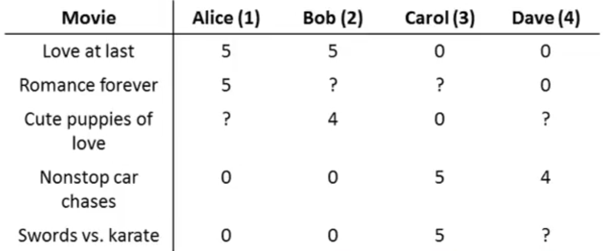

## Low Rank Matrix Factorization [^90]

### Vectorization of the Collaborative Filtering Algorithm

Given the following dataset with five movies rated by users:

We take all the ratings by all the users and group them into a $n_m \times n_u$ matrix:
$$
Y=\begin{bmatrix}5&5&0&0\\ 5&?&?&0\\ ?&4&0&?\\ 0&0&5&4\\ 0&0&5&0\end{bmatrix}
$$
Each element of this matrix — a rating of a movie by a user — was previously represented as $y^{(i,j)}$. Given this matrix of ratings there's an alternative way of writing out the predicted ratings of the algorithm.  
$$
\begin{bmatrix}
(\theta^{(1)})^T(x^{(1)}) & (\theta^{(2)})^T(x^{(1)}) & ... & (\theta^{(n_u)})^T(x^{(1)}) \\
(\theta^{(1)})^T(x^{(2)}) & (\theta^{(2)})^T(x^{(2)}) & ... & (\theta^{(n_u)})^T(x^{(2)}) \\
\vdots & \vdots & \vdots & \vdots \\
(\theta^{(1)})^T(x^{(n_m)}) & (\theta^{(2)})^T(x^{(n_m)}) & ... & (\theta^{(n_u)})^T(x^{(n_m)}) \\
\end{bmatrix}
$$
Given this representation, there's a simpler vectorized way of calculating it.

Using a matrix of features of the movies:
$$
X=\begin{bmatrix}(x^{(1)})^T \\(x^{(2)})^T \\...\\(x^{(n_m)})^T \\\end{bmatrix}
$$
And a matrix of the parameters for each of the per-user parameters:
$$
\Theta=\begin{bmatrix}(\theta^{(1)})^T \\(\theta^{(2)})^T \\...\\(\theta^{(n_u)})^T \\\end{bmatrix}
$$
In order to compute the matrix of all the predictions you can simply compute:
$$
X \Theta ^T
$$
This algorithm is known as low-rank vector factorization.

### Recommending Related Items

Using the collaborative filtering algorithm we can find related movies using the learned set of features.

For each product $i$ we learn a feature vector $x^{(i)} \in \R^n$.  Those features that we learn are not knowable in advance; but, if run, the algorithm will tend to surface features that are the important aspects of the movie that causes a user to like one movie over another.

We end up with an $n$-degree vector of features; after we've learned these, it's not really feasible to analyze those features to come up with a human-understanding of what they really are.  Usually it will learn features that are the most salient for causing a user to like or dislike the movie.

How would we find movies $j$ that are related to movie $i$?

Well, now that we've learned these feature vectors we have a very convenient way to find other movies with a similar set of features.  Specifically, if the value of $||x^{(i)}-x^{(j)}||$ is small then movie $j$ and movie $i$ are "similar."  These movies would be good candidates to recommend to a user as something else they may like.
