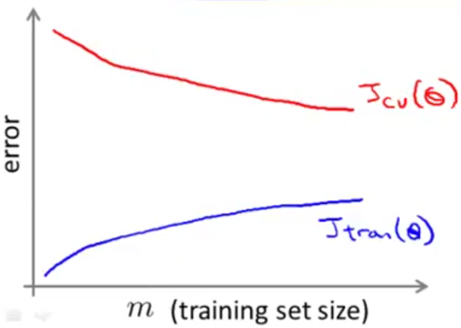
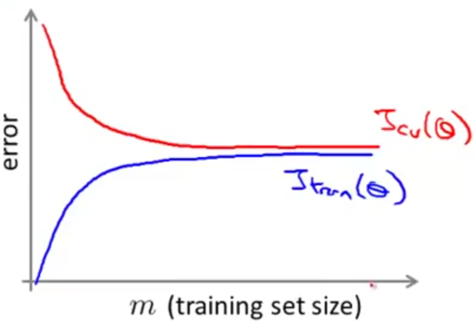

## Learning with Large Datasets

Why use large datasets?  We've seen that we get a high performance ML system if we take a low bias algorithm and train it with a lot of data.  For example, if we need to classify between confusable words (e.g. then, than), if we train with a lot of data it appears to work very well.

But learning with large datasets comes with its own computational problems.  Suppose we have a training dataset where $m$ is in the hundreds of millions of examples.  And, let's say we want to train a regression model with that dataset we will need to do summations of hundreds of millions of entries to just take one step in the gradient descent.

### Dataset Size

Of course, before we put in the effort of training against a huge dataset, we should ask if we can use a smaller dataset and have it perform just as well.

If our training set's learning curve plotted compared to the cross validation objective looks like this, then it looks like a high variance algorithm and adding more examples would improve performance:

But if our plot looks like this, high bias visualization, then it wouldn't make sense to test against more examples:

