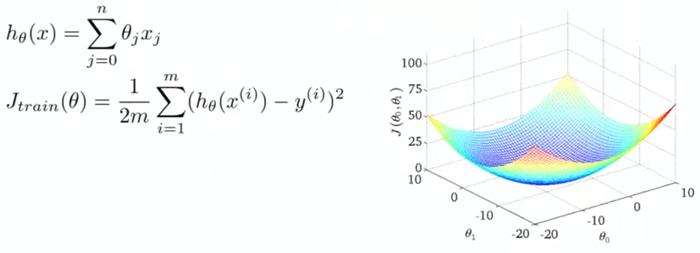

## Stochastic Gradient Descent [^93]

For many learning algorithms (e.g. linear or logistic regression, neural networks), the way we derive the algorithm is to come up with a cost function (or optimization objective) and then using an algorithm like gradient descent to minimize the cost function.

With large datasets gradient descent becomes a computationally expensive procedure. Here we discuss a modification of gradient descent to allow us to scale to much larger datasets.

**Linear Regression with Gradient Descent**

To recap $h_\theta(x)$ is our hypothesis and our cost function is $J(\theta)$, which is the sum of one half of the average square error of the hypothesis on $m$ training examples.

Plotted as a function, the cost function is illustrated above as a bowl-shaped curve, and the gradient descent algorithm is:

Repeat {

$\ \ \ \ \ \theta_j:=\theta_j-\alpha\frac{1}{m}\sum^{m}_{i=1}(h_\theta(x^{(i)})-y^{(i)})x^{(i)}_j$

​     (for every $j=0,…,n$)

}

As we run gradient descent with different iterations, then it will progress toward the global minimum.  The problem, however, with gradient descent is if $m$ is fairly large the partial derivative portion ($\frac{1}{m}\sum^{m}_{i=1}(h_\theta(x^{(i)})-y^{(i)})$) becomes computationally expensive.

For example, US census data amounts to approximately 300 million records and running gradient descent will require re-reading all 300MM records for each step of gradient descent.

What we are going to do here is to come up with a different algorithm that doesn't need to look at all examples on every iteration, but to only look at one example on a given iteration.

To illustrate stochastic gradient descent, let's write up the cost function as follows:
$$
cost(\theta, (x^{(i)}, y^{(i)})) = \frac{1}{2}(h_\theta(x^{(i)})-y^{(i)})^2 \\
J_{train}(\theta)=\frac{1}{m}\sum^m_{i=1}cost(\theta, (x^{(i)}, y^{(i)}))
$$
To express the steps for stochastic gradient descent:

1. Randomly shuffle the dataset.

2. Step through the data:

   Repeat `{`
   `    for i:=1...m {`
          $θ_j:=θ_j — α (h_θ^{(i)}-y^{(i)})\times x^{(i)}_j \\ (for\ every\ j=0,…,n)$
       }
   }

   *Note:* the term $(h_\theta^{(i)}-y^{(i)})\times x^{(i)}_j)$ is equivalent to the partial deriviative with respect to $\theta_j$ of  $cost(\theta, (x^{(i)}, y^{(i)}))$ as defined above in formula $(1)$. Also, the outer loop should only need to be run a small number of times.

What stochastic gradient descent is doing is scanning across the training examples, and only look at the first example will take a step only using that one example.  From there it will take one step, and look at the next training example, and so on, each time trying to fit a bit better.  This is whe we first shuffle the dataset.

Rather than scanning through all examples stochastic gradient descent will look at a single example and will start making progress, gradually moving the parameters in general toward the global minimum.  In practice it will typically move/congregate around the global minimum.
