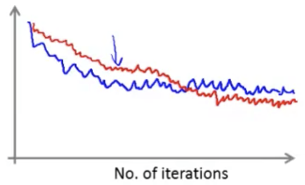
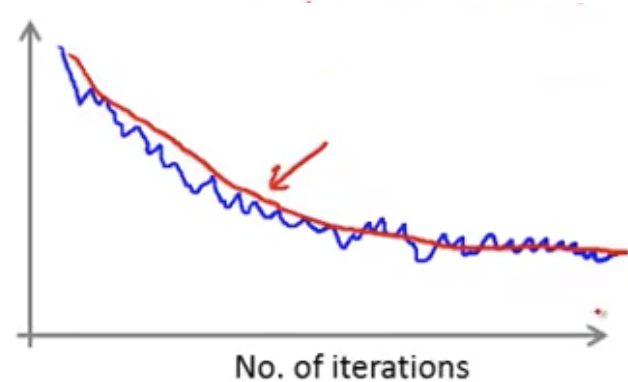
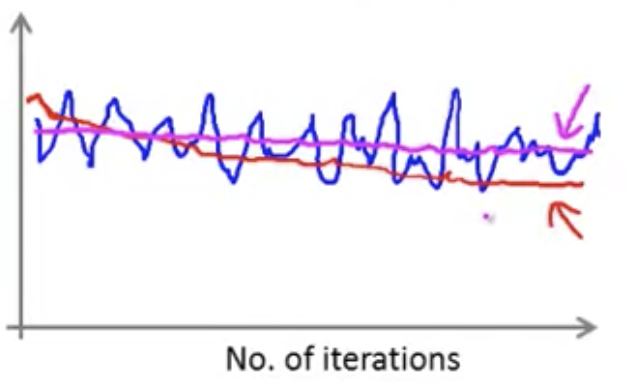
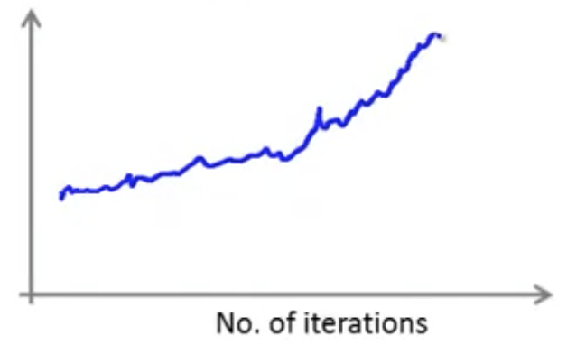

## Stochastic Gradient Descent Convergence [^95]

When using batch gradient descent we would check on every iteration to confirm that we were making progress in gradient descent by confirming that we were converging on the global minimum.  We would do this by plotting $J_{train}(\theta)$ as a function of the number of iterations of gradient descent.  To do this we'd calculate the following on every iteration:
$$
J_{train}(\theta) = \frac{1}{2m}\sum_{i=1}^{m}(h_\theta(x^{(i)})-y^{(i)})^2
$$
The summation in this calculation extends over the entire dataset of size $m$.  However, if the dataset is huge, for example $m=300,000,000$, then we'd pause on every iteration of gradient descent to read in the entire dataset in order to calculate $J_{train}(\theta)$, thereby slowing down the entire calculation dramatically.

For stochastic gradient descent in order to check that the algorithm is converging, we would check the cost of specific training example as we go along through the overall set of data.

Given the cost function we discussed earlier:
$$
cost(\theta, (x^{(i)}, y^{(i)})) = \frac{1}{2}(h_\theta(x^{(i)})-y^{(i)})^2
$$
When learning , compute $cost(\theta, (x^{(i)}, y^{(i)}))$ _before_ updating $\theta$ using $(x^{(i)}, y^{(i)})$.  We want to do this before updating theta because it might do better on this next example. In other words, as stochastic gradient descent is scanning through our training set, right before we have updated $\theta$ with a particular example $(x^{(i)}, y^{(i)})$ lets compute how well our hypothesis is doing on that training example.

Then, in order to check the convergence of stochastic gradient descent, every 1000 or so iterations we can plot $cost(\theta, (x^{(i)}, y^{(i)}))$ averaged over the last 1000 or so examples that have been processed by the the algorithm, providing a running estimate of how well it's doing.

### Example Plots of $cost(\theta,(x^{(i)},y^{(i)}))$

These examples should give a sense of the range of phenomena that can occur when we plot the cost function averaged over some range of examples, and to suggest some things we can do in response to them.

Here, in blue we see a plot averaged over the last 1000 or so examples. It's noisy because it's averaged over a small subset and looks like a pretty decent run and showing that the algorithm is converging.  In red we see a slower learning rate.  It starts out learning a bit more slowly but can end up at a slightly better solution.  Recall that stochastic gradient descent doesn't converge at a single global minimum instead the parameters will oscillate around it.  So, by using a smaller learning rate we end up with smaller oscillations, and can result in slightly better value for the prarameters.

In this example, above, in blue it looks like a good run and is showing convergence. In red we see the impact of using a larger number of examples (say, 5000 rather than 1000).  We end up with a smoother curve, as a result of increasing the number of examples.  The disadvantage is that now we're only getting feedback on every 5000 examples, and therefore feedback on how well the algorithm is learning is delayed.

Here, the blue line indicates that the algorithm is just not learning and is remaining flat.  However if we sample with a larger number of examples we may see, as in the red line, that the noise of the blue line is just hiding a very gradual downward trend.  So smoothing out the curve in this case reveals that.  Of course, even if we sample with more examples it's possible that we may end up with the magenta line, which is still flat and provides a more concrete example that our algorithm is not learning.  In that case we have to look elsewhere to improve the learning of the algorithm (e.g. change the learning rate, change the features, etc.).

Here we see that the curve is increasing, and if this is the case the algorightm is diverging, and we should use a smaller learning rate $\alpha$.

### Adjusting the Learning Rate to Converge

When we run stochastic gradient descent with a constant learning rate (the typical case) it won't ever actually converge, but will oscillate around it forever. 

However, we may want to force convergence on the global minimum.  To do so, we may slowly decrease the learning rate over time: $\alpha = \frac{const1}{iterationNumber + const2}$. To do this though we'd need to spend time playing with these two additional parameters in order to get the algorithm to work well, making the overall program more complex and finicky.
