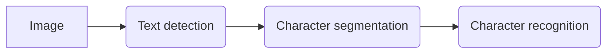

## Problem Description

Photo OCR: photo optical character recognition.  This problem focuses the computer to understand the textual content of photos.  While doing OCR on scanned documents is fairly straightforward, doing so with images is still a very challenging problem.

### Photo OCR Pipeline

In many complex ML systems it's common to organize multiple, discrete modules that act one after another on a piece of data to produce the output you want.  One of the most important decisions you'll make is how to break the problem at hand down the problem into a sequence of different steps that can be built into modules and divide up the work.

1. **Text detection**: recognizing whether an image contains text.

2. **Character segmentation**: taking the text and splitting it into individual characters.

3. **Character classification**: taking the images of individual letters and extracting the ASCII character code corresponding to it.

   *Optionally, do cleanup like spell checking.*

