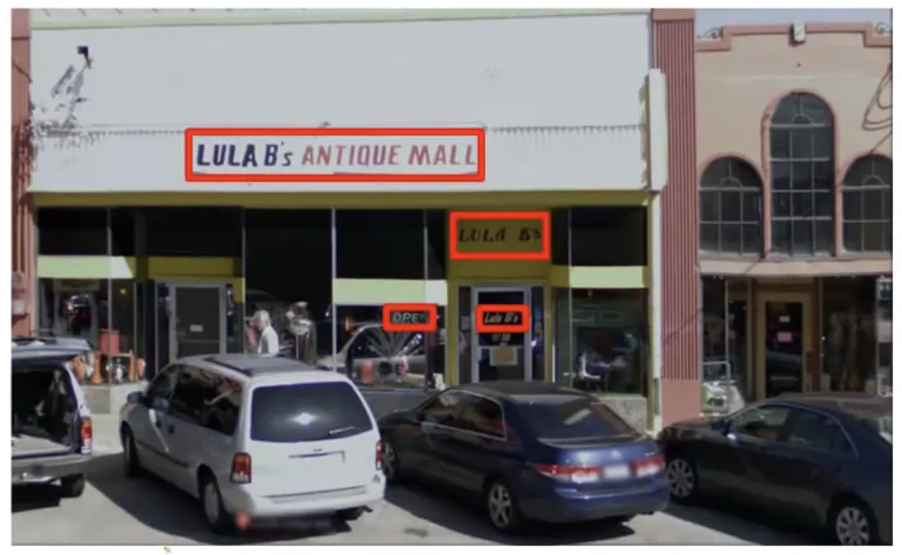
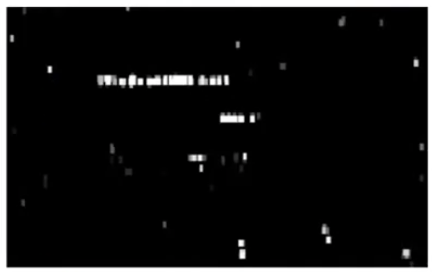
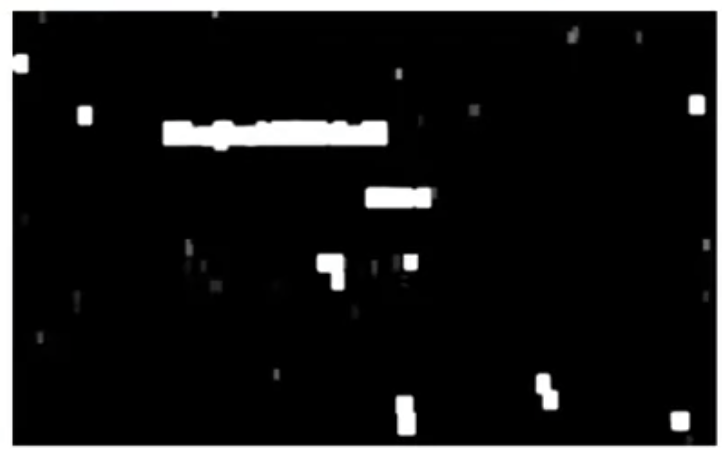
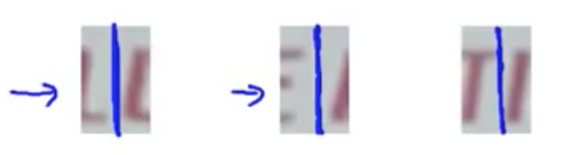
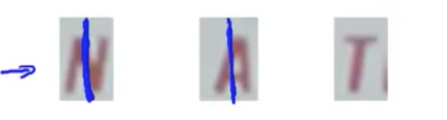

## Sliding Windows

The first step in the pipeline is text detection, where we look at an image and decide whether a specific region may have text in it.  A complicating factor in this is that the regions may be of largely varying sizes and aspect ratios.

### Recognizing Pedestrians

In order to explain the idea of sliding windows and the general process of image recognition, let's start by examining a simpler use case for image recognition.

A simplification of this problem is to recognize pedestrians, as the aspect ratio is more consistent.  For this example we choose to look at regions of, say, 82x36 pixels, and collect large numbers (1000-10000) of postive ($y=1$) and negative ($y=0$) examples which do and do not contain pedestrians in them.

When given a new, test image and we want to determine whether there are pedestrians in the image.  We use what's known as a "sliding window" across the image, incrementally sampling regions of it and determining whether a given window contains a pedestrian.  When moving the window across the image, we do so in "steps."  The step size, or "stride" is a configurable parameter, commonly one pixel; moving pixel-by-pixel is computationally expensive, so larger sizes are not uncommon.

The image is scanned several times, starting with small regions and then progressively increasing the size of the region.  In all cases, we're resizing the window to be the same size as the patches in our test data (in this example, 82x36).

### Recognizing Text

Similar to pedestrian detection, we start with a labeled training set with positive and negative examples of text in images to train our classifier.

Starting with the following source image:

After running a scan of small windows across our source image, we may end up with a result that looks like the below where the white regions show that our text detection system has found text.  Where there are regions that are black indicates that the classifier has not found text, and white is where it has found text.  Different shades of gray indicate the confidence of the classifier — where there are lighter shades of gray it thinks it found text, but is less confident about it.

Next we want to draw rectanges around all regions where we think there is text.  For this we apply what's known as an "expansion operator" that takes each of the white regions and expands them — for each pixel, if it's near a white pixel then we convert it to a white pixel.  This gives us a result like the following:

We can now look at this image and draw bounding boxes around the contiguous white regions. We can then eliminate boxes whose aspect ratios don't resemble text (e.g. vertical boxes). These regions are then considered to be areas where the classifier has a high degree of confidence that the they contain text.

### Character Segmentation

The next step in the pipeline is to take this set of regions that we believe to contain text, and  separate all of the characters within those image blocks into discrete image blocks.

As before, we use a supervised learning algorithm with sets of positive and negative examples.  What we will do is look at the image patch and try to decide if there's a split between two characters in the center of the patch.

Example positive case:

Example negative case:

Because the aspect ratio of these regions are horizontal, we only do a 1D sliding window from L to R, looking for boundaries between characters.  When it identifies positive cases, then we draw a line on the image to identify the boundary.

From there we are able to split the set of regions into a set of images where we have high confidence that it contains a character.

Finally we run a multi-class classifier on each of those character images to determine what ASCII character it contains.
