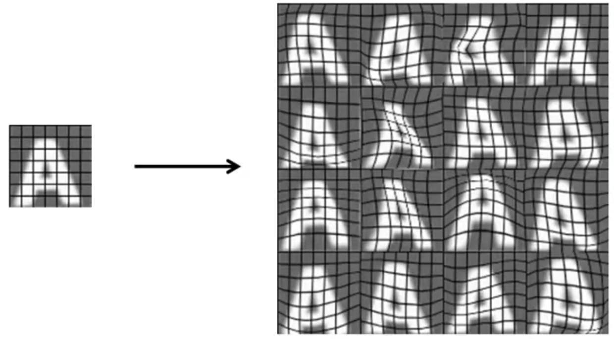

## Getting Lots of Data: Artificial Data Synthesis [^98]

When recognizing characters, in order to improve the data set that we traing the classifier on, we can generate a lot of additional data by applying distortion effects or different fonts to existing textual data.

For example, here we have a single letter "A," and by applying distortions to the letter we can can amplify this data set from one letter to 16 letters:

From the domain of speech recognition, we can start with a single sound, and then add different distortions to it: bad cellphone connection, noisy background (e.g. a crowded street, machinery) to multiply the example to many different examples.

### Discussion

The distortions introduced should be representative of the type of noise/distortions in the test set. It usually does not help to add purely random/meaningless noise to your data.

Before expending a lot of effort you should make sure that you have a low bias classifier before putting the effort into generating a large dataset.  For example, keep increasing the number of features/number of hidden units in the neural network until you have a low bias classifier.

Evaluate how feasible it would be to gather more data, sometimes it will not be hard to gather 10x more data and can improve your result.  Ways to gather more data:

* Artificial data synthesis
* Collect/label it yourself
* Crowd source it (e.g. Mechanical Turk)
