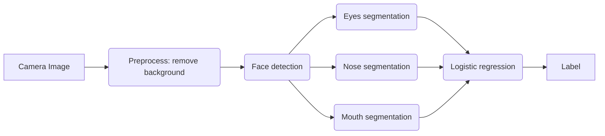

## Ceiling Analysis: What Part of the Pipeline to Work on Next

We want to be sure that when investing time in working on the different steps of the pipeline that we're spending time in the places where that work will have the most impact.

For this we employ a technique known as "ceiling analysis."  For this we will want to have some real number evaluation metric for the output of the overall system, such as accuracy of OCR of the pipeline.

When improving various modules of the pipeline we may find that even if we do a lot of work to improve one step of the pipeline it may not have a significant impact on the _overall_ accuracy of the system.  It's important to understand the impact of work done on each module in that context.

Here's a more complex illustration of this idea based on this example of a facial recognition pipeline:

Let's assume that the accuracy of the overall system is 85% and we want to improve it.  

We may start by manually introducing images whose backgrounds have already been removed, thus making the preprocess step have an accuracy of 100%, and see how it impacts the overall accuracy.  Suppose that doing this improves accuracy to only 85.1%, we can then imply that further improvements to the preprocess step is not worth the time.

Extending this to each step in the pipeline (i.e. by inserting completely accurate data for each step to see its impact on the overall system):

| Component                | Accuracy |
| ------------------------ | -------- |
| Overall System           | 85%      |
| Preprocess (remove bkgd) | 85.1%    |
| Face detection           | 91%      |
| Eyes segmentation        | 95%      |
| Nose segmentation        | 96%      |
| Mouth segmentation       | 97%      |
| Logistic regression      | 100%     |

So based on this we see that inserting perfectly accurate face detection improves accuracy by 5.9% and inserting perfectly accurate eye segmentation improves overall accuracy by 4%.  As a result we can infer that investing our time in improving those components would be most beneficial to overall accuracy of the system.
